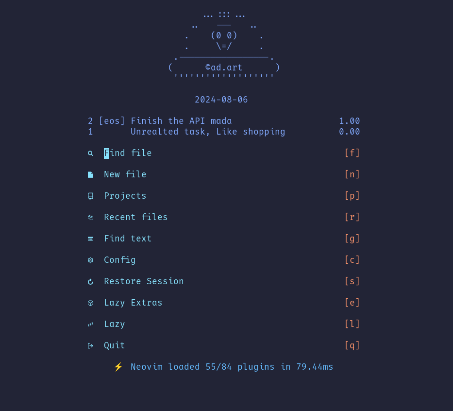
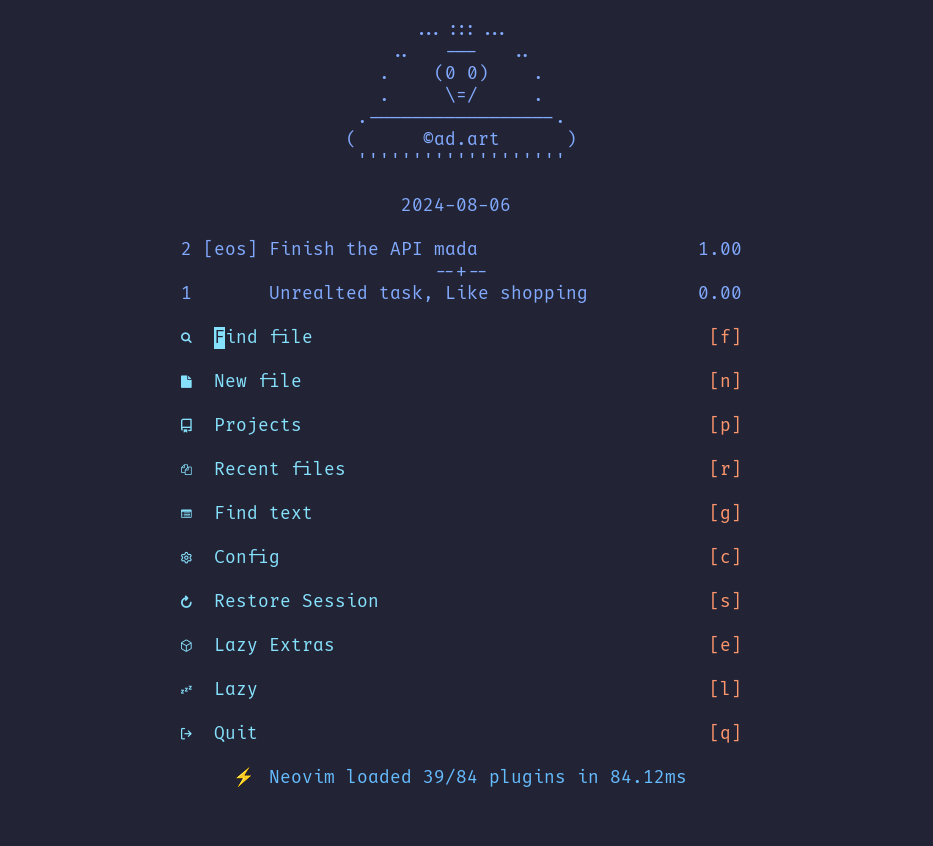
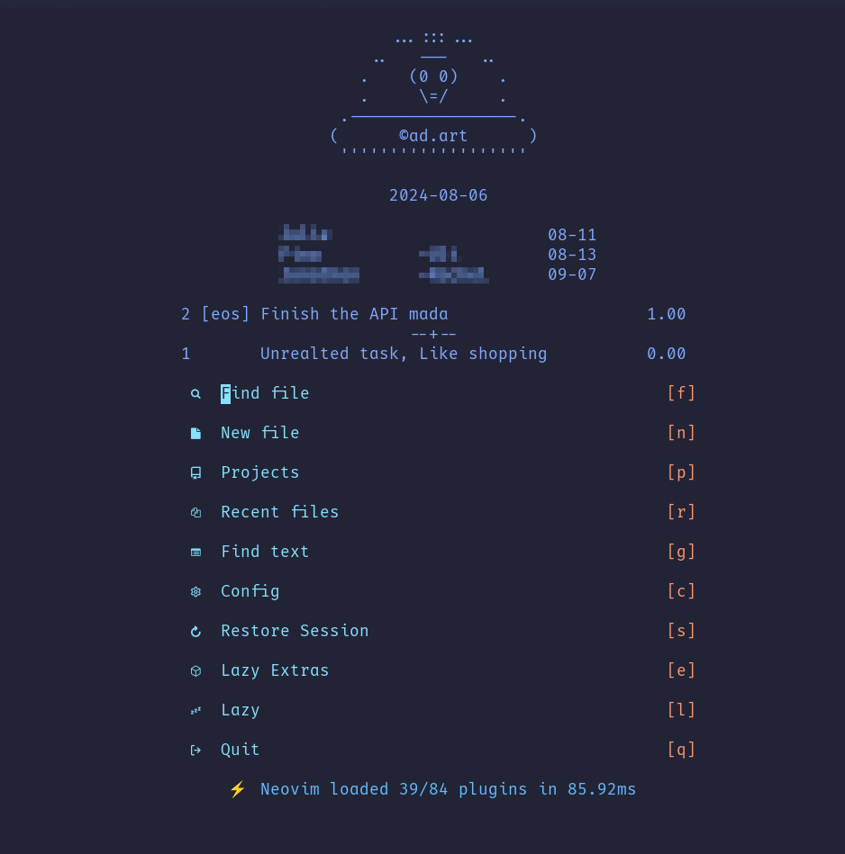

# little-taskwarrior.nvim

A little helper for displaying TaskWarrior's tasks.

## Features

For now this plugin offers the following features:

- List of task as list of string to use in the Dashboard
  - For current project and others
  - Just a few most urgent tasks

## Screens

### Tasks list without project file



### Tasks list with a project file



### Task list with my plugin next-birthday



## Installation

You can install `little-taskwarrior.nvim` using your favorite package manager.
For example with `Lazy`:

```lua
 {
  "praczet/little-taskwarrior.nvim",
  config = function()
    require("little-taskwarrior").setup({ })
  end,
}
```

## Dependency

- **[TaskWarrior](https://taskwarrior.org/)** - it uses standard export command form it
- **[Dashboard-nvim](https://github.com/nvimdev/dashboard-nvim)** - if you want to use it in a dashboard

## Configuration

```lua
--- Default configuration
M.config = {
 --- configuration for the Dashboard
 dashboard = {
  --- task limit
  limit = 5,
  --- max number of columns
  max_width = 50,
  --- if > 0 then  additional task (besides current project ones) will be added
  non_project_limit = 5,
  --- not used yet
  use_colors = true,
  --- List of columns to be displayed
  columns = {
   "id",
   "project",
   "description",
   "due",
   "urgency",
  },
  --- List of replacements when getting lines for dashboard
  project_replacements = {
   ["work."] = "w.",
   ["personal."] = "p.",
  },
 },
 --- toggle the loggin
 debug = true,
 --- where information about taskwarrior project can be found
 project_info = ".little-taskwarrior.json",
 --- not used yet (the idea is to mark task about this)
 urgency_threshold = 9,
}
```

So for example to make the area of task list wider you can do:

```lua
{
  "praczet/little-taskwarrior.nvim",
  config = function()
    require("little-taskwarrior").setup({
      dashboard = {
        max_width = 80
      }
    })
  end,
}
```

## Usage

Of course you can use it as you want. I mean you can get the list and print it.

```vim
lua print(vim.inspect(require("little-taskwarrior").get_dashboard_tasks()))
```

### Integration with Dashboard-nvim

Based on my dashboard.lua config (I am using LazyVim)

```lua
return {
  {
    "nvimdev/dashboard-nvim",
    opts = function()
      -- Getting dashboard tasks
      local ltw = require("little-taskwarrior")
      local tasks = ltw.get_dashboard_tasks()

      local logo = [[

...:::...
..   ---   ..
.    (0 0)    .
.     \=/     .
.-----------------.
(      ©ad.art      )
'''''''''''''''''''
    ]]
      local currentDate = os.date("%Y-%m-%d")
      local padding = math.floor((10 - #currentDate) / 2)
      local centeredDate = string.rep(" ", padding) .. currentDate
      logo = logo .. "\n" .. centeredDate .. "\n"
      local header = vim.split(logo, "\n")
      if tasks ~= nil then
        for _, t in ipairs(tasks) do
          table.insert(header, t)
        end
        table.insert(header, "")
      end

      local opts = {
        theme = "doom",
        config = {
          header = header,
          -- ... There is more like center, footer etc.
        },
      }
      return opts
    end,
  },
}
```

### Project file or not

If in the folder (project folder or current folder) file named
`.little-taskwarrior.json` exists. This plugin will try to read project name:

For example:

```json
{
  "project": "eos"
}
```

If it succeeds it will use it as project name therefore the display mode will be
switched to project specific mode. Which means the first task will be taken for
that specific project. And then (if configuration allows) other tasks will be
loaded. You can see this in [Tasks list with a project file](###Tasks list with a project file)

### project_replacements

This configuration requires a little explanation. The best explanation I can
give will be by example.
Let's assume that we have projects related to `work` and several projects
related to `personal`.
In the `personal` project we have projects like:

- `personal.dashboard-nvim`
- `personal.little-taskwarrior`

So task could look like this:

```bash
task add "I need to do something" project:personal.dashboard-nvim
```

But instead of displaying `personal.dashboard-nvim` we want to display
`p.dashboard-nvim`

Then we can add replacements in the configuration:

```lua
 project_replacements = {
   ["work."] = "w.",
   ["personal."] = "p.",
  },
```

> [!note]
> Replacements can by as regular expression

## TODO

- [ ] feat: Shortening project names by separator
- [ ] feat: List of task in Telescope
- [ ] feat: Highlight urgent tasks
- [ ] feat: Preview task
- [ ] feat: Add task from selection or for current line
